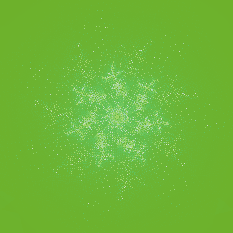
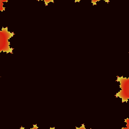
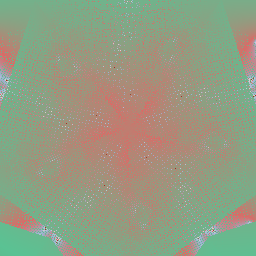
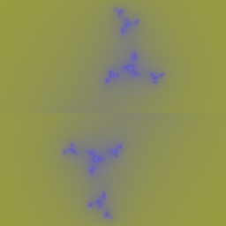
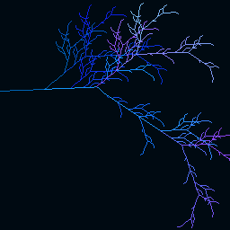

# 🔮 Fractal-Hash

[](https://github.com/tyrenker/fractal-hash/actions/workflows/ci.yml)
[](https://www.npmjs.com/package/fractal-hash)
[](./LICENSE)
[](https://nodejs.org)

> Turn any cryptographic hash, SSH fingerprint, or arbitrary string into unique, deterministic fractal art.

## Why?

Humans are terrible at comparing hex strings — `a3f9…` and `a3e9…` look identical at a glance. But we're excellent at recognising visual patterns. Fractal-Hash converts any hash into a vivid, deterministic fractal: identical inputs produce identical images, and a single-bit change produces a completely different fractal. Use it to visually verify SSH host keys, compare release checksums, or add visual flair to any identity system.

## Gallery

Same input → identical fractal, every time. Different input → completely different image.

| `SHA256:nThbg6kX…` | `bitcoin-genesis` | `ed25519-key` | `hello` |
|:---:|:---:|:---:|:---:|
|  |  |  |  |

## One-Character Sensitivity

A single character change produces a completely different fractal — you see the difference instantly.

| Input: `"v1.0.0"` | Input: `"v1.0.1"` |
|:---:|:---:|
|  |  |

```bash
npx fractal-hash --format png --size 256 -o v1.0.0.png "v1.0.0"
npx fractal-hash --format png --size 256 -o v1.0.1.png "v1.0.1"
```

## Install

```bash
npm install fractal-hash
```

Node.js ≥ 18 required (uses the Web Crypto API).

## Quick Start

```typescript
import { fractalHash } from 'fractal-hash';

// Returns a data:image/png;base64,... URL (Node.js default)
const image = await fractalHash('SHA256:nThbg6kXUpJWGl7E1IGOCspRomTxdCARLviKw6E5SY8');

// Explicit format
const png  = await fractalHash('my-fingerprint', { format: 'png', size: 512 });
const svg  = await fractalHash('my-fingerprint', { format: 'svg', size: 256 });
const ansi = await fractalHash('my-fingerprint', { format: 'ansi' });
```

## CLI

```bash
# ANSI art in your terminal (default)
npx fractal-hash "SHA256:nThbg6kXUpJWGl7E1IGOCspRomTxdCARLviKw6E5SY8"

# Save a 512×512 PNG
npx fractal-hash --format png --size 512 -o fractal.png "my-key"

# SVG to stdout
npx fractal-hash --format svg "my-key" > fractal.svg

# Read from stdin
echo "my-key" | npx fractal-hash --stdin
```

| Option | Description |
|--------|-------------|
| `--format <fmt>` | Output format: `ansi`, `png`, `svg` (default: `ansi`) |
| `--size <n>` | Image size in pixels (default: `256`) |
| `--output, -o <path>` | Output file path (for png/svg) |
| `--background <bg>` | Background: `dark`, `light`, `transparent` (default: `dark`) |
| `--stdin` | Read hash from stdin |

## Browser Demo

Run `npm run demo` then open `http://localhost:3000/examples/browser-demo/` to see:

- Live rendering as you type (debounced)
- Side-by-side 1-character-change sensitivity comparison
- Download 512×512 PNG
- Gallery of famous fingerprints
- Dark / light theme toggle

## How It Works

```
Input String
    │
    ▼
Normalizer          — hex / base64 / SSH-fingerprint / SHA-256 fallback → 32 bytes
    │
    ▼
Parameter Extractor — 32 bytes → FractalConfig (fractal type, seed, palette, symmetry…)
    │
    ▼
Fractal Renderer    — Julia Set / Sierpinski / L-System / Dragon Curve
    │
    ▼
Output Renderer     — Canvas / SVG / PNG / ANSI
```

Hash bytes are mapped deterministically to fractal parameters. Any change in the input propagates through the fractal seed, producing a chaotically different image — the butterfly effect makes single-bit changes visually obvious.

## Fractal Types

| Type | Description |
|------|-------------|
| **Julia Set** | Smooth escape-time coloring with N-fold symmetry |
| **Sierpinski** | Chaos game triangle with xorshift RNG seeded by hash |
| **L-System** | Turtle graphics from hash-selected grammar rules |
| **Dragon Curve** | Iterative paper-fold curve seeded by hash bytes |

The fractal type is selected deterministically from the input hash — the same input always produces the same type and parameters.

## Supported Input Formats

| Format | Example |
|--------|---------|
| 64-char hex | `a3f9b2c1…` (32 bytes) |
| Base64 | `o/my5Jx…` |
| SSH fingerprint | `SHA256:nThbg6kXUpJ…` |
| Colon-separated hex | `aa:bb:cc:dd:…` |
| Any string | Falls back to SHA-256 |

## API Reference

### `fractalHash(input, options?): Promise<string>`

The main entry point.

| Option | Type | Default | Description |
|--------|------|---------|-------------|
| `format` | `'png' \| 'svg' \| 'canvas' \| 'ansi'` | auto | Output format |
| `size` | `number` | `256` | Image dimensions in pixels (square) |
| `background` | `'dark' \| 'light' \| 'transparent'` | `'dark'` | Background style |

Returns:
- `'png'` → `data:image/png;base64,...`
- `'svg'` → raw SVG string
- `'canvas'` → `data:image/png;base64,...` (browser only)
- `'ansi'` → ANSI escape-code string for terminal rendering

### `morphFractals(hashA, hashB, options?): Promise<string>`

Generates an animated GIF that morphs between the fractal for `hashA` and `hashB`.

| Option | Type | Default | Description |
|--------|------|---------|-------------|
| `frames` | `number` | `24` | Number of animation frames |
| `delay` | `number` | `50` | Frame delay in milliseconds |
| `size` | `number` | `256` | Image dimensions in pixels |

Returns a `data:image/gif;base64,...` URL.

### `sonifyHash(input, options?): Promise<Uint8Array>`

Converts a hash into a WAV audio file. Hash bytes are mapped to pitch, waveform, tempo, and ADSR envelope parameters.

| Option | Type | Default | Description |
|--------|------|---------|-------------|
| `duration` | `number` | `4` | Audio length in seconds |
| `sampleRate` | `number` | `44100` | Sample rate in Hz |

Returns raw WAV file bytes.

### `describeFractal(input): Promise<string>`

Returns a human-readable text description of the fractal suitable for screen readers and accessibility contexts.

Example output: `"A vibrant triadic Julia set with 5-fold symmetry in deep blue and teal tones, high complexity."`

### `renderWebGL(input, canvas, options?): Promise<void>`

Renders a 3D Mandelbulb fractal onto a WebGL canvas using a GLSL ray-marching shader. Browser only.

### React Component

```tsx
import { FractalHashImage } from 'fractal-hash/react';

<FractalHashImage hash="SHA256:nThbg6kX..." size={128} background="dark" />
```

Renders an `` element with an auto-generated `alt` attribute from `describeFractal`. Shows a placeholder while loading.

## Integrations

### VS Code Extension

Hover over any hash string in your editor to see its fractal thumbnail inline. Supports SHA-256, SHA-512, SHA-1, MD5, and SSH fingerprints.

See [`extensions/vscode-extension/`](./extensions/vscode-extension/README.md).

### Browser Extension

Displays a fractal fingerprint for TLS certificates on every HTTPS page, making it easy to spot certificate changes at a glance.

See [`extensions/browser-extension/`](./extensions/browser-extension/README.md).

### SSH Terminal Plugin

Renders fractal art for SSH host key fingerprints inline in iTerm2, Kitty, and WezTerm — similar to OpenSSH randomart but more visually distinct.

See [`integrations/ssh-plugin/`](./integrations/ssh-plugin/README.md).

### GitHub Action

Generates fractal PNG thumbnails for release asset checksums and posts them to the release notes automatically.

See [`integrations/github-action/`](./integrations/github-action/README.md).

## Determinism

Fractal-Hash is deterministic by design:

- Same input → **identical pixel arrays** on every platform, every time
- Verified with 193 tests including 100-iteration determinism checks
- Zero external runtime dependencies (only `node:zlib` for PNG encoding)
- Formal specification: [`docs/RFC_VISUAL_HASH.md`](./docs/RFC_VISUAL_HASH.md)

## Contributing

Issues and pull requests are welcome at [github.com/tyrenker/fractal-hash](https://github.com/tyrenker/fractal-hash/issues).

## License

MIT © 2026 Fractal-Hash Contributors
